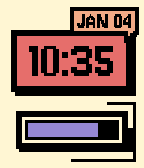
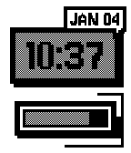
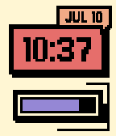

# Neubrutalism — a Pebble watchface


A Pebble watchface with a bold, chunky **neubrutalism** aesthetic: a thick black
outline, hard color blocks, and a pixel-style Jersey font. The bottom bar doubles
as a battery meter or a daily-steps progress bar, and the whole palette can be
swapped between several color themes.

## Hardware

Built for the revived Pebble platform (Core Devices / PebbleOS). Ships for
**aplite** (Pebble classic), **basalt** (Pebble Time), **diorite** (Pebble 2),
**emery** (Pebble Time 2), and **flint** (Pebble 2 Duo) — the layout and
type sizes adapt to each display.

## Features

- **Neubrutalist clock** — a pixel-style Jersey time in an orange block on a
  pastel-yellow ground, framed by a thick black outline.
- **Date** — short day/month, rendered in the matching font.
- **Bottom progress bar** — choose what it shows: **battery level** or progress
  toward your **daily step goal**.
- **Color themes** — Neubrutalism (default), Game Boy Green, Ocean Blue, Amber
  LCD, Monochrome, and Purple Pixel.
- **12/24-hour time** — your preference, set on the phone.

## Settings (on your phone)

Time format (12/24-hour), color theme, what the bottom bar represents (battery
or steps), and the daily step target (1,000–100,000, default 10,000). Open the
watchface's settings from the Pebble app to configure them.

## Screenshots

| Basalt | Aplite | Theme |
| --- | --- | --- |
|  |  |  |

## Build & run

```bash
npm install                          # JS deps; Node 24 LTS per .nvmrc
npm test                             # JS unit tests
./scripts/test-c.sh                  # host-side C tests (no SDK needed)
pebble build
pebble install --emulator basalt
pebble install --phone               # a paired watch (CloudPebble relay; needs Dev Connect on)
```

See [CONTRIBUTING.md](CONTRIBUTING.md) for the full dev setup and
[`docs/QA-checklist.md`](docs/QA-checklist.md) for the on-device test pass.

## Contributing

Contributions are welcome — see [CONTRIBUTING.md](CONTRIBUTING.md). Commits follow
the [Conventional Commits](https://www.conventionalcommits.org/en/v1.0.0/)
specification.

## Testing

The phone-side JS is unit-tested with Jest and runs in CI on every push/PR:

```bash
npm test -- --coverage
```

The watch build itself is compiled in CI on every push/PR:

```bash
./scripts/build-watch.sh
```

## License

This project is licensed under the [MIT License](LICENSE).
